# 热身 App MVP PRD · 独立版

> 由 `warmup-app-mvp-prd/index.html` 转换而来，保留原 PRD 的正文结构、页面截图引用、功能需求和验收标准。

## 目录

- [概览](#概览)
- [为什么做](#为什么做)
- [给谁做](#给谁做)
- [怎么做](#怎么做)
- [MVP 页面](#mvp-页面)
- [做到什么程度](#做到什么程度)
- [功能需求](#功能需求)
- [怎么验收](#怎么验收)

## 概览

**MVP PRD · 开屏页 · 五步定制 · 动态热身 · 每日食谱提醒**

### 一个专注“训练前 8 分钟”的热身 App。

这个 MVP 不做完整健身平台，只解决用户进入训练前最容易被忽略的一步：打开 App 后先用开屏页完成品牌露出，再通过五步个性化问卷了解用户，用热身方向选择页承接今天的训练目标，最后通过热身前自检决定是进入动态热身，还是休息择日再练。饮食定制只在问卷中确认意愿，计划生成后放到“我的”主页；系统每天早上推送“今日食谱已完成，快运动起来吧”，提醒用户先运动、再按当天食谱规律饮食。

### 关键指标

- **12 页**：开屏、定制、热身、我的、饮食定制
- **30-60 秒**：完成热身前自检
- **5-8 分钟**：动态热身核心时长
- **五个热身活动**：可以覆盖全身所需

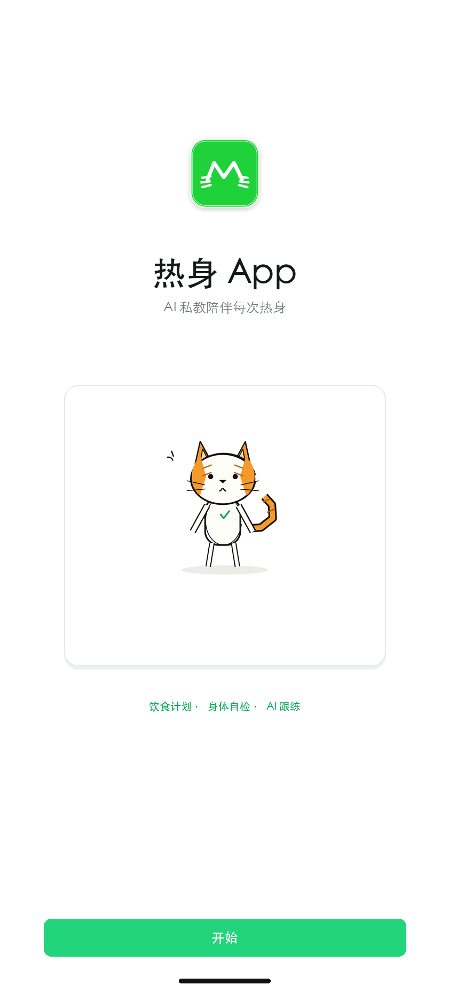

## 为什么做

很多新手小白知道自己要开始运动，却不知道怎样热身才专业：网上动作零散、健身房指导不稳定、不同训练目标对应的热身方式也不一样。这个 MVP 的核心价值，是给新手提供一个低门槛、标准化、可执行的专业热身渠道；饮食定制和早晨食谱推送作为训练后的轻量延展，用来承接用户“练完之后怎么吃”和“明天如何继续”的基础需求。

### 用户问题：不知道怎么热身

新手常常只做几下拉伸就开始训练，或者直接照搬网上动作，不知道每个动作对应什么部位、做多久、做到什么程度。

### 产品价值：提供专业化热身渠道

产品把练胸日、练背日、练肩日、练腿日和练全身拆成清晰模块，让用户按训练目标选择对应方案，而不是自己临时搜索和拼凑。

### 体验目标：像教练一样带着做

每次热身都给出动作顺序、时间、重点提示和完成状态，让新手知道下一步做什么；训练结束后把饮食定制入口放到“我的”，第二天早上再用今日食谱推送召回用户，形成“提醒运动 - 完成热身 - 按食谱吃”的日常闭环。

## 给谁做

MVP 先服务已有运动意愿、但不知道如何专业热身的新手小白和初阶健身用户；他们往往也需要训练后的基础饮食建议，以及每天早上一个明确的提醒来开始当天计划，但不希望在训练前被复杂饮食方案打断。不优先服务已经训练多年、拥有成熟热身和饮食体系的人群。

### 核心用户：健身房训练 0-6 个月

准备进入练胸日、练背日、练肩日或练腿日等力量训练，但不知道应该先做哪些热身动作、每个动作做多久、做到什么程度。

### 使用场景：训练开始前

用户早上收到“今日食谱已完成，快运动起来吧”的提醒，进入 App 后选择对应训练日并完成 5-8 分钟专项热身；训练结束后再从“我的”主页查看当天食谱并按计划饮食。

### 不建议人群：训练经验丰富者

已经长期训练、拥有固定热身习惯和成熟饮食安排，并能自主设计动作组合的人群，不是 MVP 的主要目标用户。

## 怎么做

MVP 流程必须短、明确、可中断。用户打开 App 后先看到开屏页，再完成五步个性化定制：性别、运动经历、体型基础、身高体重和饮食定制意愿。用户选择“暂时不用”时直接进入热身方向选择页；选择“是，帮我定制”时先生成入门饮食计划并放到“我的”主页，同样不打断训练前流程。系统每天早上推送“今日食谱已完成，快运动起来吧”，让用户先被食谱提醒召回，再完成运动，最后按当天食谱规律饮食。

### 1. 开屏页

展示 logo、产品名和一句定位，短暂停留后进入个性化定制。

### 2. 选择性别

完成第一步轻量个性化设置，用于基础强度提示。

### 3. 运动经历

选择曾做过的运动类型，决定默认讲解细度和强度。

### 4. 体型基础

按 BMI < 24 / BMI ≥ 24 区分小基数和大基数，用于判断动作冲击和饮食建议方向。

### 5. 身高体重

填写身高和体重，生成初始身体画像和热身强度建议。

### 6. 饮食定制意愿

选择是否需要训练后饮食定制；需要时生成计划并放到“我的”主页，暂时不用则直接进入热身方向。

### 7. 选择热身方向

汇总展示练胸日、练背日、练肩日、练腿日和练全身，用户选择今天要进入的热身模块。

### 8. 热身前自检

确认心率、关节、呼吸和身体感觉。

### 9. 不适提示

检测到不适时，建议今天先不训练，休息并择日再练。

### 10. 进入热身

自检通过后进入倒计时页，展示动作进度、运动时长和估计消耗。

### 11. 动态热身

自检通过后完成 4 个动作，时长 5-8 分钟。

### 12. 完成记录

记录自检、热身完成率、跳过原因和用户选择。

### 13. 我的与饮食定制

完成训练后在“我的”主页查看今日数据，并通过小栏目进入饮食定制结果页。

### 14. 次日食谱提醒

第二天早上推送“今日食谱已完成，快运动起来吧”，提醒用户先运动，运动后按当天食谱饮食。

## MVP 页面

以下按当前演示顺序展示 12 个 MVP 页面：开屏页、性别选择、身高体重、运动经历、饮食定制选择、热身方向选择、练胸日热身、热身前自检、不适提示、进入热身、我的主页和饮食定制结果页。每日食谱提醒属于系统行为规则，不额外占用页面。

### 热身 App 开屏页

### 性别选择页

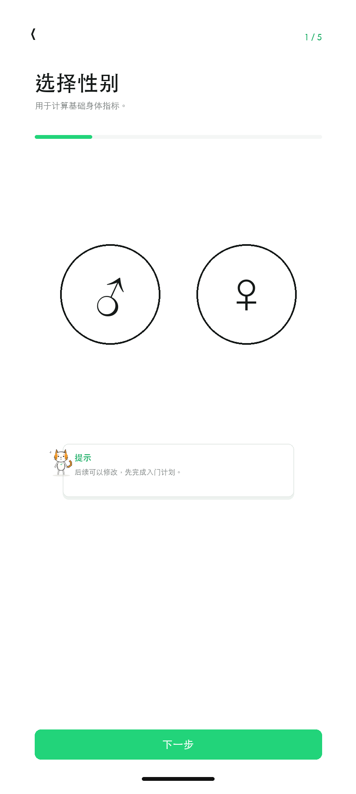

### 身高体重选择页

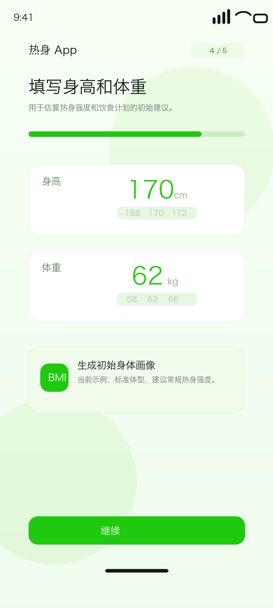

### 运动经历选择页

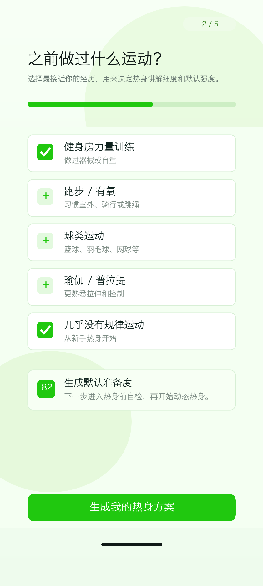

### 饮食定制选择页

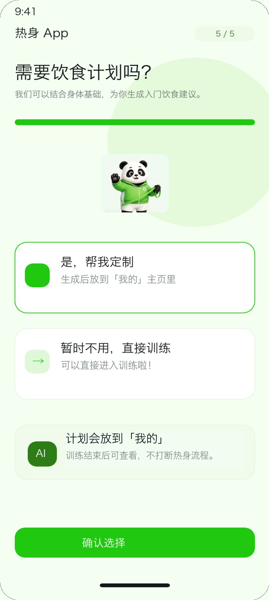

### 热身方向选择页

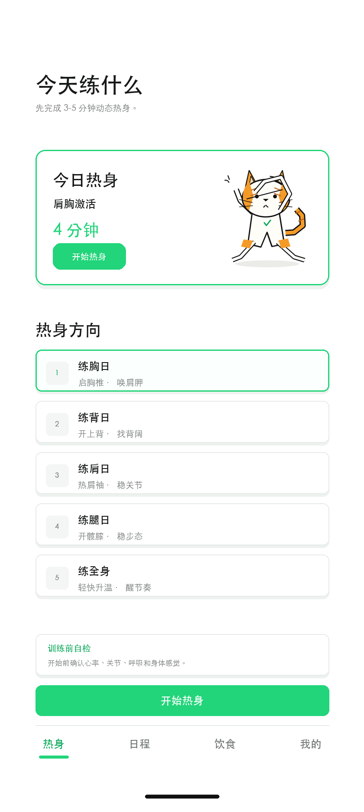

### 练胸日热身页

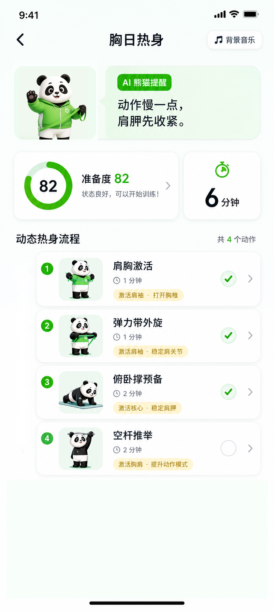

### 热身前自检页

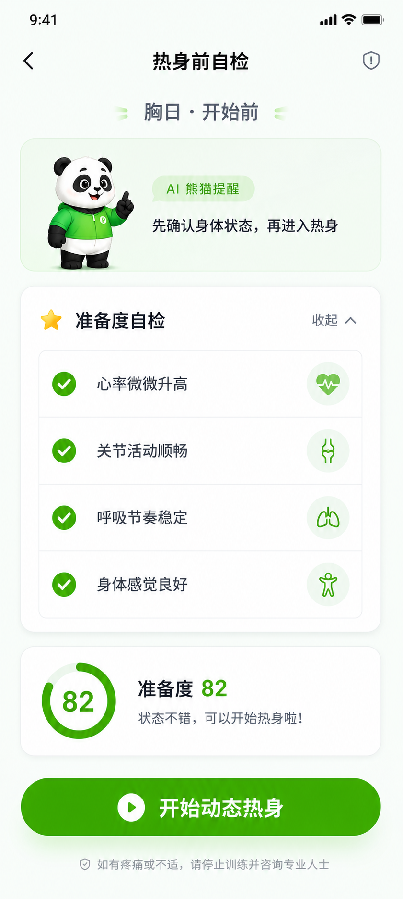

### 不适提示页

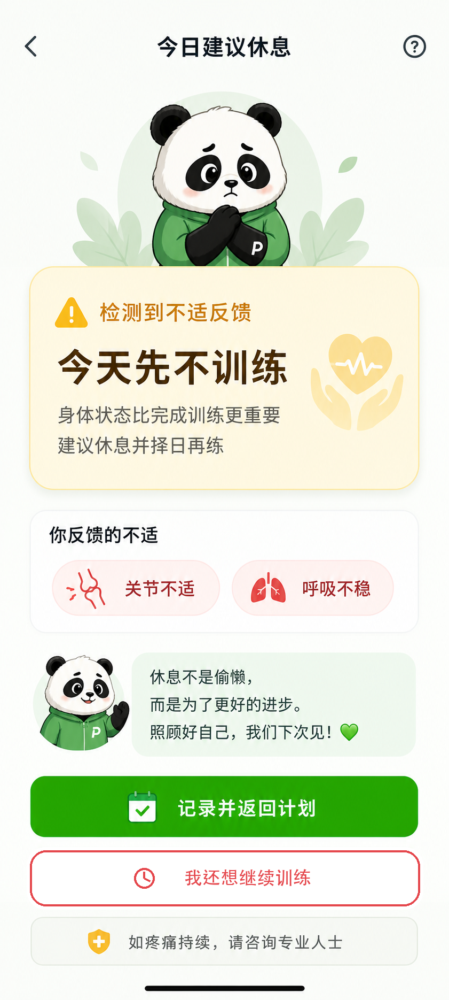

### 进入热身页

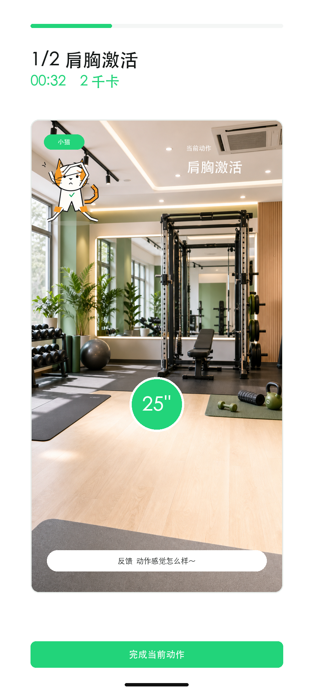

### 我的主页

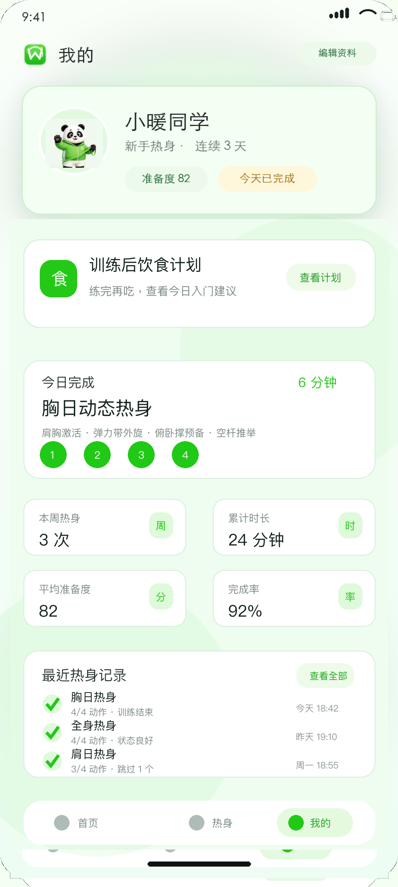

### 饮食定制结果页

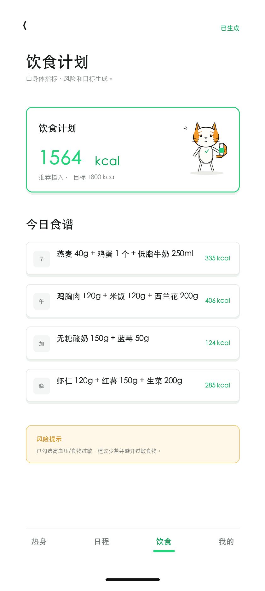

## 做到什么程度

MVP 做到可演示、可跟练、可验收的第一版热身闭环：用户能从开屏页进入 App，完成五步个性化定制，确认是否需要训练后饮食定制，然后直接进入热身方向选择页，完成 5-8 分钟动作流程，并在“我的”主页看到个人数据和训练后饮食定制入口；同时定义每日早晨食谱完成推送，用于第二天召回用户继续运动。

### P0 包含

- 5 个热身活动：练胸日、练背日、练肩日、练腿日、练全身。
- 开屏页、5 步个性化定制和热身方向选择页：品牌启动、性别、运动经历、体型基础、身高体重、饮食定制意愿、五类训练方向入口。
- 我的主页：展示头像昵称、训练后饮食定制入口、今日完成练习、累计热身数据和最近热身记录。
- 饮食定制结果页：从“我的”主页进入，展示每日热量目标和入门饮食建议。
- 每日食谱提醒：每天早上推送“今日食谱已完成，快运动起来吧”，点击后可进入热身方向或饮食计划入口。
- 每个活动 4 个动作，单次流程控制在 5-8 分钟。
- 每个动作展示名称、时长、动作目的和完成状态。
- 热身前自检和不适提示作为安全前置，不作为核心卖点。

### 暂不包含

- 完整训练课程、训练计划编排和动作识别。
- 高度个性化算法、AI 动作纠错和穿戴设备接入。
- 医疗诊断、康复处方和疾病风险评估。
- 账号体系、会员体系、社区功能和商业化模块。

## 功能需求

P0 的需求按开屏页、个性化定制、训练后饮食定制入口、每日食谱提醒、热身方向选择、热身活动、页面状态和记录能力拆开，确保新手能从打开 App 到完成热身，并在第二天继续被召回，形成完整闭环。

| 模块 | P0 要求 | 关键状态 | 后续增强 |
| --- | --- | --- | --- |
| 开屏页 | 打开 App 时展示 logo、产品名和一句定位，短暂停留后进入个性化定制。 | 首次打开、加载中、进入定制。 | 节日皮肤、品牌动效、启动加载优化。 |
| 个性化定制 | 用五步轻量问卷收集性别、运动经历、体型基础、身高体重和饮食定制意愿，用于默认强度、讲解细度、热身方案和训练后饮食建议提示。 | 未填写、已选择、返回修改、跳过。 | 目标肌群、疼痛史、训练频率、装备条件。 |
| 训练后饮食定制 | 展示“是否需要饮食定制”选择；选择“是”后生成入门饮食计划并放到“我的”主页，选择“暂时不用”直接进入热身方向选择页。饮食计划用于用户训练后查看和执行，不阻断训练前流程。 | 是、否、已生成、我的主页入口、饮食定制结果页。 | 热量目标、三餐建议、食物偏好、过敏禁忌。 |
| 每日食谱提醒 | 对已选择饮食定制的用户，每天早上推送“今日食谱已完成，快运动起来吧”。推送目标是先召回用户开始运动，运动后再引导用户按当天食谱规律饮食。 | 食谱已生成、推送已发送、用户点击、用户关闭、进入热身或查看食谱。 | 自定义推送时间、连续打卡、按训练日自动调整食谱。 |
| 热身方向选择 | 汇总展示练胸日、练背日、练肩日、练腿日、练全身五类热身方向，让用户在完成个性化定制后先选定今天的热身模块。 | 首次选择、返回修改、选择热身方向。 | 训练日推荐、历史热身入口、会员转化。 |
| 热身前自检 | 展示心率、关节、呼吸、身体感觉四项检查和准备度分。 | 全部正常、部分异常、用户未填写。 | 接入心率、睡眠、疲劳和历史训练记录。 |
| 进入热身页 | 自检正常后展示动作进度、倒计时、运动时长、估计消耗和播放控制。 | 倒计时中、暂停、上一动作、下一动作、完成当前动作。 | 动作讲解视频、实时卡路里估算、节拍提示。 |
| 不适提示 | 当用户反馈不适时展示“今日建议休息”，推荐记录并返回计划。 | 返回计划、我还想继续训练、咨询专业人士。 | 连续异常提醒、择日提醒、风险分级。 |
| 动态热身 | 按练胸日、练背日、练肩日、练腿日、练全身展示 4 个动态热身动作、时间和完成状态。 | 热身活动切换、完成、跳过、准备度不足、动作未完成。 | 动作视频、语音提示、AI 动作质量检测。 |
| 记录与报告 | 记录自检结果、异常原因、热身完成率、用户选择和时间，并在我的主页展示今日练习、累计数据、最近热身记录和饮食定制入口。 | 本次记录、今日完成、周趋势、异常次数。 | 趋势图、训练表现关联、个性化热身模板。 |

## 怎么验收

验收重点是流程是否清晰、安全分支是否可靠、页面是否能独立支撑热身 App 的 MVP 说明。

1. 用户打开 App 后能先看到开屏页，开屏页只做品牌露出和产品定位，不承载热身方向选择。
2. 用户能完成性别、运动经历、体型基础、身高体重和饮食定制意愿五步定制，并理解饮食定制会在训练后放到“我的”主页，不阻断热身流程。
3. 饮食定制选择页必须提供“是，帮我定制”和“暂时不用，直接训练”两个选项；选择否后进入热身方向选择页，选择是后生成计划并在“我的”主页出现入口。
4. 饮食定制结果页从“我的”主页进入，展示每日热量目标、蛋白质优先、主食不过量、蔬菜补足和返回我的按钮。
5. 每日食谱提醒文案必须明确为“今日食谱已完成，快运动起来吧”，表达顺序是先提醒用户运动，再引导用户训练后按食谱饮食。
6. 用户第二天早上收到食谱完成提醒后，点击应能进入热身方向选择或“我的”主页饮食计划入口，不能让食谱流程挡在热身流程前面。
7. 热身方向选择页放在热身前自检之前，能让用户选择练胸日、练背日、练肩日、练腿日或练全身。
8. 用户能在 60 秒内完成热身前自检，并看到准备度分。
9. 自检全部正常时，主按钮先进入热身页，展示倒计时、运动时长和估计消耗。
10. 用户反馈关节不适、呼吸不稳或身体不舒服时，必须进入“不适提示页”。
11. 不适提示页默认推荐“记录并返回计划”，并用红色按钮提供“我还想继续训练”。
12. 不适提示页不能直接出现“开始热身”或“开始训练”作为推荐按钮。
13. 练胸日、练背日、练肩日、练腿日、练全身热身页均展示 4 个动作、总时长和完成状态。
14. 我的主页展示头像昵称，并在头像卡片下方突出训练后饮食定制入口，同时保留今日完成练习、累计时长、完成率和最近热身记录。
15. 系统记录自检结果、异常原因、热身完成率和用户最终选择。
16. 所有页面保持 9:20 竖屏视觉，桌面和移动端 PRD 均可正常查看。

---

热身 App MVP PRD · 从 AI 熊猫教练热身模块独立抽出 · 含每日食谱提醒与训练后饮食定制
